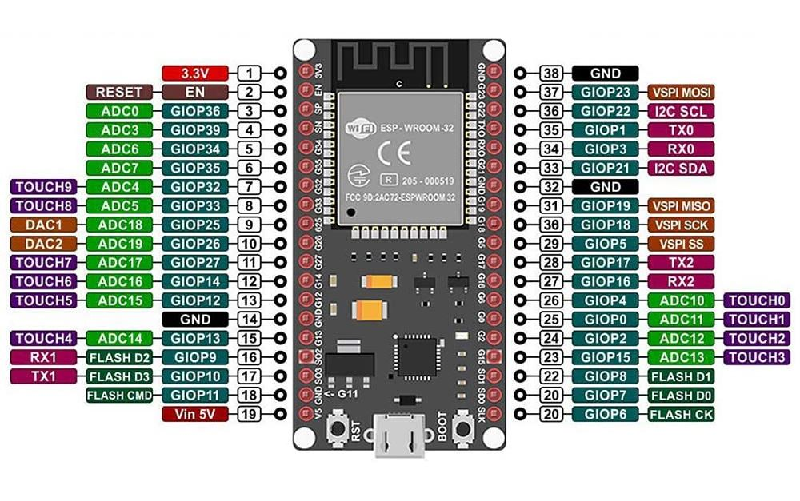
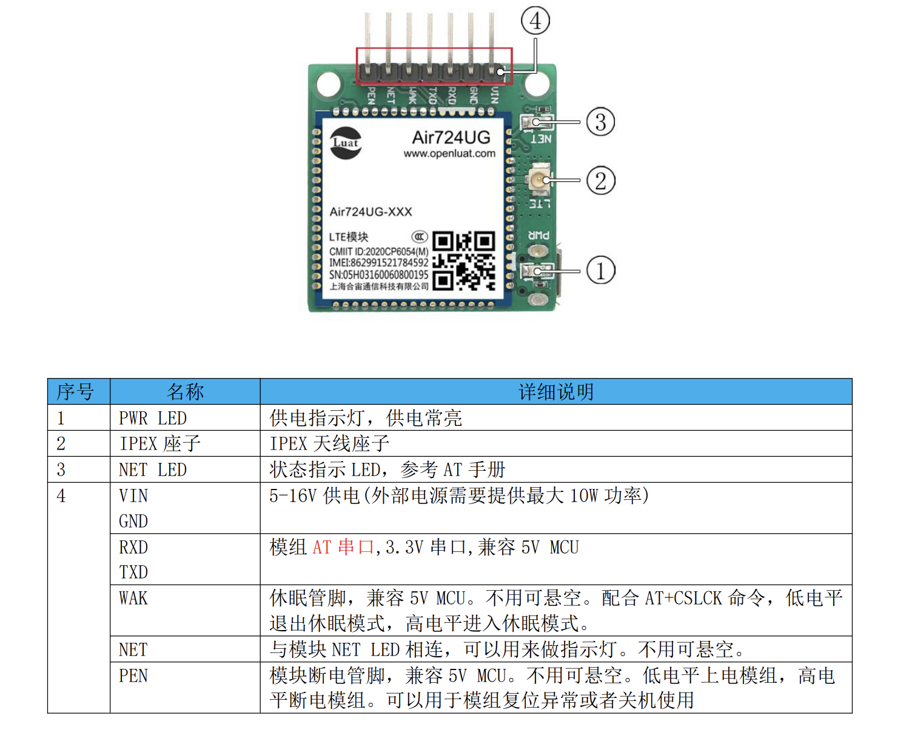
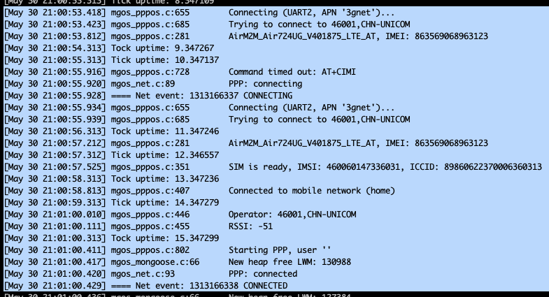

Mongoose OS (2.20.0) firmware for Air724UG AT with NAT feature, if U do not use 4G module, also U can connect to sta as a wifi nat router extended like:

https://github.com/dchristl/esp32_nat_router_extended

ESP32

Air724UG

Working

Wifi Ap

ssid: debug_??????

pass: aA1234567890

mos build --arch esp32 --verbose --clean --local

mos flash build/fw.zip --esp-erase-chip --catch-core-dumps no

PIN output

ESP32                           Air724UG

GPIO 16 RX        ------>       TX

GPIO 17 TX        ------>       RX

GPIO 5  pwrKey    ------>       PEN (Module 0:Power On 1:Power Off)

V5                ------>       VCC

GND               ------>       GND
